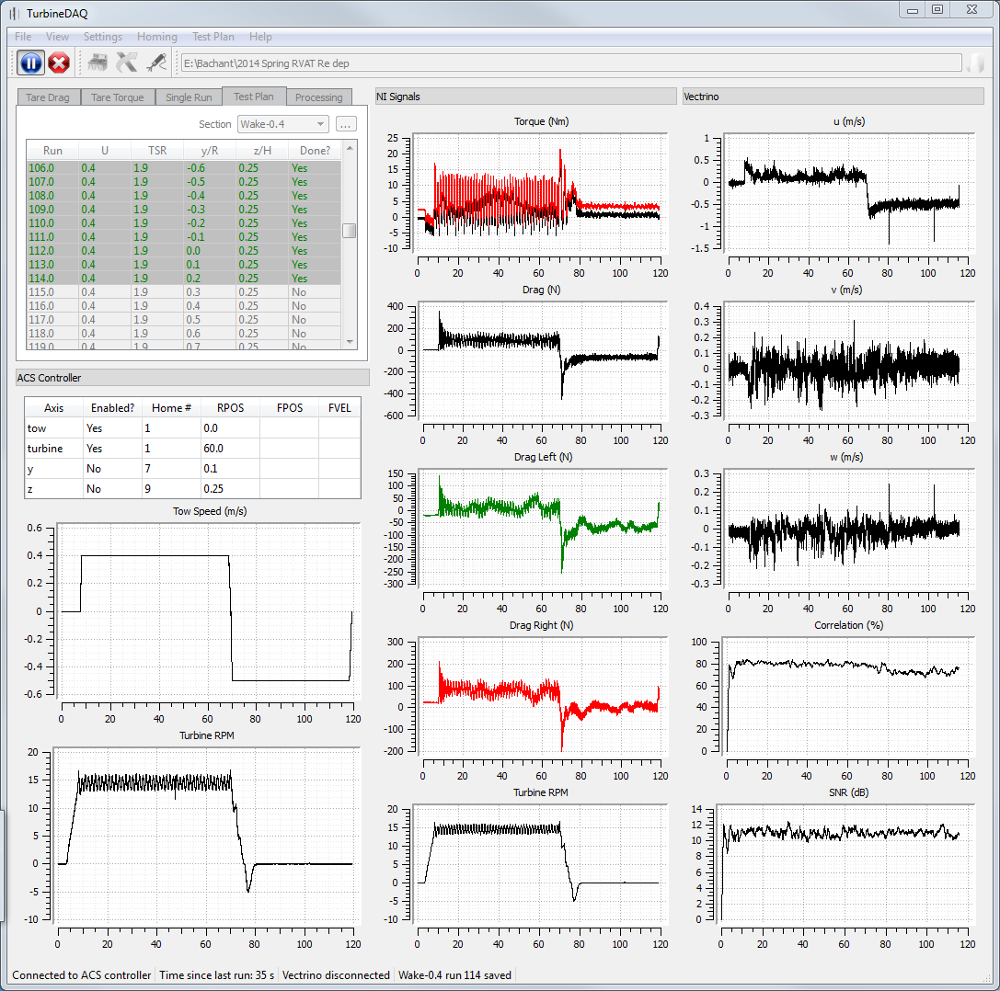

TurbineDAQ
==========

[](https://waffle.io/petebachant/turbinedaq)

A Python desktop app for automated turbine data acquisition in the UNH tow tank. 




## Test plan

A matrix of test parameters should be created and placed in the `Test plan` directory.
Each "section" of the experiment gets its own CSV file. See `test/Test plan` for an
example. The test plan, if one exists, is loaded into the GUI at startup. To change, it must be
edited externally and reloaded. 


## Directory and file structure

```
Experiment name/
    Config/
        Test plan/
            Top level.csv
            Perf-0.8.csv
            Tare_drag.csv
        fbg_properties.json
        turbine_properties.json
    Data/
        Processed/
            Perf-0.8.csv
            Tare_drag.csv
        Raw/
            Perf-0.8/
                0/
                    metadata.json
                    acsdata.h5
                    nidata.h5
                    vecdata.h5
                    fbgdata.h5
                    vecdata.vno
                1/    
                    metadata.json
                    acsdata.h5
                    fbgdata.h5
                    nidata.h5
                    vecdata.h5
                    vecdata.vno
            Tare_drag/
                0/
                    metadata.json
                    acsdata.h5
                    nidata.h5
```

## Types of runs
In the `runtypes` module, there are classes to represent each type of run:

  * `TurbineTow`
  * `TareDragRun`
  * `TareTorqueRun`

Each of these subclass PyQt's `QThread`. For future experiments, there will likely be
a `TurbineTowInWaves` or options in `TurbineTow` for wave generation with `makewaves`. 


License
-------

TurbineDAQ Copyright (c) 2013-2015 Peter Bachant

This program is free software: you can redistribute it and/or modify
it under the terms of the GNU General Public License as published by
the Free Software Foundation, either version 3 of the License, or
(at your option) any later version.

This program is distributed in the hope that it will be useful,
but WITHOUT ANY WARRANTY; without even the implied warranty of
MERCHANTABILITY or FITNESS FOR A PARTICULAR PURPOSE.  See the
GNU General Public License for more details.

You should have received a copy of the GNU General Public License
along with this program.  If not, see <http://www.gnu.org/licenses/>.
